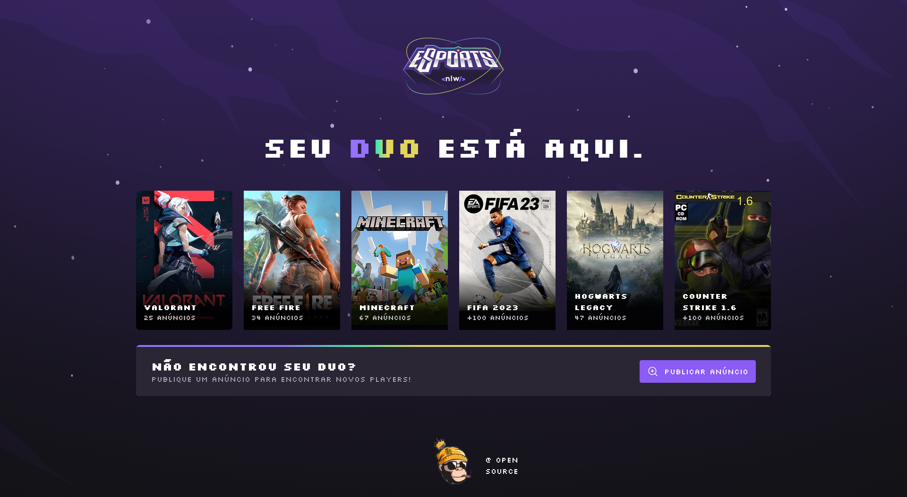

    

 

Projeto em andamento clique **[aqui](https://nlw-esport-duo.vercel.app/)**, para acessar o projeto 
## 🧪 Tecnologias

Esse projeto foi desenvolvido com as seguintes tecnologias:

- [React](https://reactjs.org)
- [Vitejs](https://vitejs.dev/)
- [TypeScript](https://www.typescriptlang.org/)

## 💻 Projeto

Find you duo é um projeto desenvolvido junto a Rocktseat com a proposta de encontrar "duo" um parceiro para jogar algum game

Este é um projeto desenvolvido durante a **[Next Level Week eSports](https://nlw-esport-duo.vercel.app/)**, apresentada dos dias 11 a 18 de Setembro de 2022.

## 🔖 Layout

Você pode visualizar o layout do projeto através do link abaixo:

- [Layout Web](https://www.figma.com/community/file/1150897317533332617) 

Lembrando que você precisa ter uma conta no [Figma](http://figma.com/).

## 📝 License

Esse projeto está sob a licença MIT. Veja o arquivo [LICENSE](LICENSE.md) para mais detalhes.

